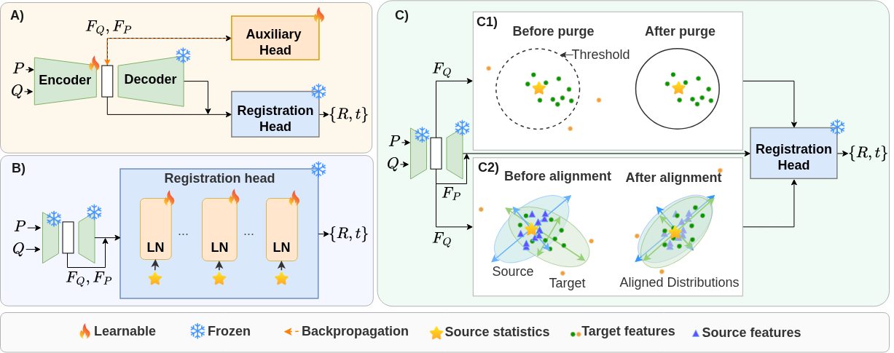

# Test Time Adaptation Methods for Point Cloud Registration in Laparoscopic Surgery

by **Nina Bodelot, [Soufiane Belharbi](https://scholar.google.com/citations?user=br7lo4MAAAAJ&hl=en), [Eric Granger](https://scholar.google.com/citations?user=TmfbdagAAAAJ&hl=en)**

LIVIA, Dept. of Systems Engineering, ETS Montreal, Canada

<p align="center">

</p>


## Abstract

<details>
<summary>Details (Click here to expand)</summary>

3D point cloud registration in laparoscopic surgery estimates the transformation between an intraoperative organ reconstructed from video and its preoperative mesh. Since ground-truth transformations are unavailable for real data, supervised networks are trained on synthetic organ pairs. At test time, however, real reconstructions differ from synthetic ones and are noisy, sparse and occluded, degrading correspondence estimation. Test-time adaptation (TTA) methods can address this domain shift at inference and have been applied successfully on tasks such as classification and segmentation. However, these methods typically rely on logits, entropy, class prototypes, or cache memory mechanisms unavailable in registration. Moreover, TTA methods assume a single shifted input, whereas registration involves a pair with an asymmetric shift, which mainly affects the intraoperative cloud, making TTA for registration much more challenging. This paper provides state-of-the-art TTA methods for 3D registration tasks across three families: model, normalization, and input adaptation. In particular, we analyze and modify four representative methods from those families that perform: auxiliary-task model update, backpropagation-free token purging, feature alignment, and layer-normalization calibration. TTA methods are modified to account for the asymmetric domain shifts between the preoperative and intraoperative point clouds, and to replace the entropy-based mechanism from classification. Given a correspondence-based model trained on clean source synthetic data, we consider two scenarios for the target: synthetic data with corruption and real data. We experiment on the P2P and P2ILReg datasets. We apply eight corruptions separately to those datasets on the synthetic target data only, such as uniform noise and global density decrease, with five increasing levels of severity. Our experiments show that all methods improve registration on the P2P dataset, while normalization adaptation degrades registration on the P2ILReg datasets. Given the computational overhead of the backpropagation-based method, input adaptation is a more promising family for laparoscopic surgery, with low inference latency and a consistent reduction in error across all datasets.

</details>


## Installation

**Pip virtual environment**

We recommand using uv+pip to setup the environment

We tested the code on python 3.10 and pytorch 2.12.0 with CUDA 13.0

```
uv venv ttareg --python 3.10.13
source ttareg/bin/activate
uv pip install torch torchvision
uv pip install requirements.txt
cd PARENet
uv pip install -e . --no-build-isolation
cd pareconv/extensions/pointops/
python setup.py install
cd ../../../..
```

To test on the dataset P2ILReg, you will need pytorch3d

```
wget https://github.com/facebookresearch/pytorch3d/archive/refs/tags/v0.7.9.zip
mv v0.7.9.zip pytorch3d-0.7.9.zip
unzip pytorch3d-0.7.9.zip
cd pytorch3d-0.7.9
uv pip install -e . --no-build-isolation
cd ..
```

## Prepare

### Datasets

- Download P2PSilico synthetic dataset here : [https://github.com/zixinyang9109/P2P](https://github.com/zixinyang9109/P2P)
- Download P2ILreg dataset with Kaggle CLI : [https://www.kaggle.com/datasets/junezhou001/p2i-lreg](https://www.kaggle.com/datasets/junezhou001/p2i-lreg) with`kaggle datasets download junezhou001/p2i-lreg`

### Corrupt the synthetic dataset

```
cd data/corruptions/create_corruptions
python create_p2psilico_corrupted_dataset.py --dataset_root your_p2p_dataset_root
python create_p2ilreg_corrupted_dataset.py --dataset_root your_p2ilreg_dataset_root
```

### Dataset path : 
Once you download the dataset, you need to adjust the paths in the config file.

## Train and test

The commands can be found in commands.sh

e.g.
```
python train.py --backbone PARENet        --dataset P2PSilico --method Source_Only
```

```
python test.py --backbone PARENet --dataset P2PSilico   --method LN_TTA --corruption uniform --severity 1 --snapshot SNAPSHOT --ln_momentum 0.05
```

For Point-TTA:

```
python test.py --backbone PARENet --dataset P2PSilico   --method LN_TTA --corruption uniform --severity 1 --meta_snapshot META_SNAPSHOT
```

## Citation

```
@article{bodelot2026arxiv,
  title = {{Test Time Adaptation Methods for Point Cloud Registration in Laparoscopic Surgery}},
  author = {Bodelot, Nina and Belharbi, Soufiane and Granger, Eric},
  journal = arxiv,
  volume  = {},
  year    = {2026}
}
```

## Acknowledgment

Our code is developed based on [https://github.com/yaorz97/PARENet](https://github.com/yaorz97/PARENet)